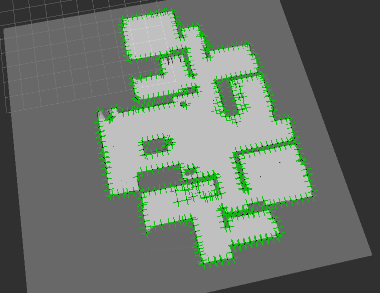
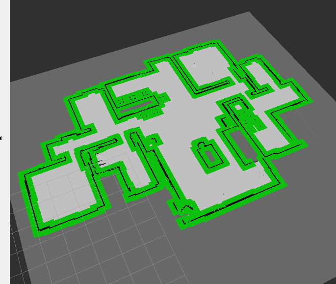
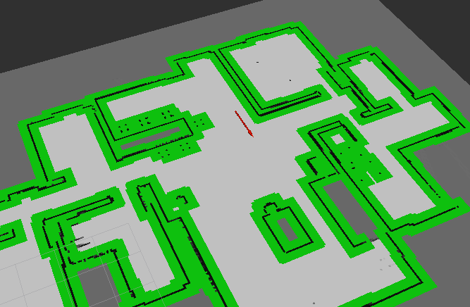
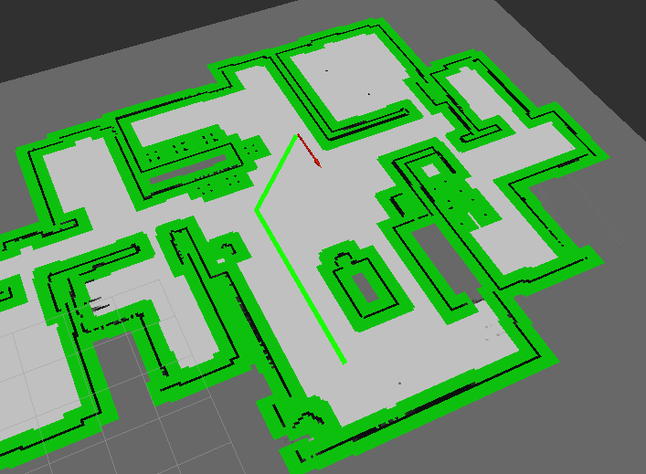
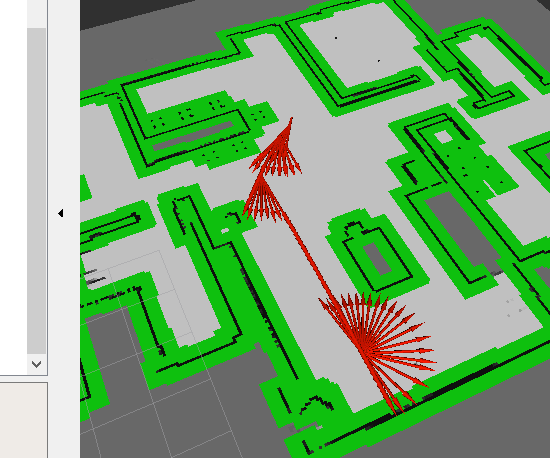

# Sub2 정리


## 그리드맵 + A* / Dijkstra 알고리즘

grid 맵의 한 칸을 노드라고 했을 때, Dijkstra는 출발 노드에서 모든 노드까지의 최단거리를 구하는 알고리즘이다. 여기서 나아가 A*는 현재 상태의 비용을 g(x), 현재 상태에서 다음 상태로 이동할 때의 휴리스틱 함수를 h(x)라고 할 때, 둘을 더한 f(x) = g(x) + h(x)가 최소가 되는 지점을 우선적으로 탐색하는 방법이다.

f(x)가 작은 값부터 탐색하는 특성상 우선순위 큐가 사용된다. 휴리스틱 함수 h(x)에 따라 성능이 극명하게 갈리며, f(x) = g(x)일 때 Dijkstra 알고리즘과 동일하다.

1. f(x)*f*(*x*)를 오름차순 우선순위 큐에 노드로 삽입한다.
2. 우선순위 큐를 pop한다.
3. 해당 노드에서 이동할 수 있는 노드를 찾는다.
4. 그 노드들의 f(x)*f*(*x*)를 구한다.
5. 그 노드들을 우선순위 큐에 삽입한다.
6. 목표 노드에 도달할 때까지 반복한다.

```python
# pesudo code

# 우선순위 큐가 비어있지 않은 동안 우선순위 큐에서 pop한다.
while pq is not empty
	node = pq.dequeue
    
    if node == goal_node # 해당 노드가 목표 노드이면 반복문을 빠져나온다.
    	break
    # 해당 노드에서 이동할 수 있는 다음 노드들을 보는 동안 우선순위 큐에 다음 노드를 삽입한다.
    for next_node in (next_node_begin...next_node_end)
    	pq.enqueue(next_node, g(node) + cost + h(next_node))
        
return goal_node_dist # 시작 노드에서 목표 노드까지의 거리를 출력한다.
```


**A*를 사용하는 이유**

- 다익스트라의 현실 적용이 매우 어려움
- 실제 공간을 모두 노드화시키기에는 수가 지나치게 많아질 수 있고, 시간 복잡도 문제가 발생한다.
- 노드화하여 탐색한 경로가 자동차 정체 구간, 출근길 등 다양한 변수로 인해 오히려 더 느려질 수 있다.

현재 대부분의 차량 네비게이션은 A*를 발전시킨 `D* (Dynamic A*)`를 사용한다.


## 코드

### 1) load_map

로직2만 완성하면 된다.

```python
        # 로직 2. 맵 데이터 읽고, 2차원 행렬로 변환
        
        # smarthome1의 맵 데이터 경로
        full_path = 'C:\\Users\\multicampus\\Desktop\\S05P21B202\\ros2_smart_home\\src\\sub2\\map\\map.txt'
        self.f = open(full_path, 'r')
        # map에는 데이터가 한 줄로 저장되어 있음 (열어보면 여러 줄로 보이지만 한 줄임)
        line = self.f.readline().split() # map 데이터 한 줄로 모두 읽어옴
        line_data = list(map(int, line)) # 데이터 int로 모두 바꿈
        
        for num, data in enumerate(line_data) :
            self.map_data[num] = data

        map_to_grid = np.array(self.map_data) # array로 만들기
        grid = np.reshape(map_to_grid, (350, 350)) # 350 * 350 행렬로 변환시켜 저장


        for y in range(350):
            for x in range(350):
                if grid[x][y]==100 :
                    # 로직 3. 점유영역 근처 필터처리
                    cnt_minus = 5
                    cnt_plus = 5
                    while cnt_minus > 0 and cnt_plus > 0:
                        if x - cnt_minus > 0:
                            grid[x-cnt_minus][y] = 127
                        if y - cnt_minus > 0:
                            grid[x][y-cnt_minus] = 127
                        cnt_minus -= 1
                        if x + cnt_plus < 350:
                            grid[x+cnt_plus][y] = 127
                        if y + cnt_plus < 350:
                            grid[x][y+cnt_plus] = 127
                        cnt_plus -= 1

        
        np_map_data=grid.reshape(1,350*350) # 다시 한 줄로 만들기
        list_map_data=np_map_data.tolist()
```




필터 처리가 기대하던 것과 다르게 되었다. 똑바로 고친 코드는 다음과 같다.

```python
        # 색칠하기
        for x in range(350):
            for y in range(350):
                if grid[x][y] == 100:
                    # 로직 3. 점유영역 근처 필터처리
                    for i in range(y-6, y+6):
                        if grid[x][i] != 100:
                            grid[x][i] = 127
                        for j in range(x-6, x+6):
                            if grid[j][i] != 100:
                                grid[j][i] = 127
```




### Odom.py

sub1의 odom.py에서 초기 위치를 지정해주는 과정만 거치면 된다.

listener_callback에 초기 위치가 지정되어있지 않은 경우 지정해주는 코드를 네 줄 정도 추가해줬다.

```python
...
        if self.is_imu ==True:
            if self.is_status == False:
                self.x = msg.twist.angular.x
                self.y = msg.twist.angular.y
                self.theta = msg.twist.linear.z * pi/180
                self.is_status=True
                self.prev_time=rclpy.clock.Clock().now()
            else:
                ...
```

self.is_status 가 False라면 초기 상태가 지정되지 않았다는 뜻이므로 turtlebot_status의 절대 좌표와 방향을 self.x, self.y, self.theta에 저장해준다. 그 후 self.is_status를 True로 바꾼다.



그 결과 odom의 위치가 잘 표시된다.


### a_star.py

다익스트라 알고리즘은 초반에 완성했지만 제대로 동작하지 않아 한참을 헤맸다.

아직도 정확히는 모르겠지만, 돌아보니 문제는 다음과 같았다.

- 맵의 특정 위치와 2D goal pose로 찍은 맵의 위치가 맞지 않음.
- a_star를 실행하면 로봇의 위치가 마치 어떤 공간에 갇혀있는 듯한 모습을 보였다.
- a_star 이전에 load_map을 할 때 grid를 transpose하면 실제로 로봇이 작은 네모에 갇혀있는 모습으로 보인다.

위 세 가지를 통해 grid 맵을 구성할 때 뭔가 문제가 있음을 알 수 있다.

처음에는 load_map을 할 때, 그리고 odom에서 뭔가 바꾸려고 한참 시도를 했다. 이틀 정도 한듯

그런데 결국 load_map과 odom은 rviz2에서 확인할 수 있듯이 정상적으로 출력이 되는 것으로 결론 내렸고, 문제는 a_star에 있었다.

a_star에서도 grid를 구성하는 과정이 있는데, 이 부분을 캐치하지 못하고 엉뚱한데서 헤매고 있었다.

로직3에서 맵 데이터를 행렬로 바꿀 때, 다음의 코드를 거친다.

```python
    def grid_update(self):
        self.is_grid_update=True
        
        # 로직 3. 맵 데이터 행렬로 바꾸기
        map_to_grid = np.array(self.map_msg.data)
        self.grid = np.reshape(map_to_grid, (350, 350))
```

reshape를 하는 과정에서 열을 먼저 채워야 하는데 행을 먼저 채웠던 걸로 추측하고, order = "F" 라는 코드를 추가해서 열을 먼저? 채우게 했다.

```python
    def grid_update(self):
        self.is_grid_update=True
        '''
        로직 3. 맵 데이터 행렬로 바꾸기
        '''
        map_to_grid=np.array(self.map_msg.data)
        self.grid=np.reshape(map_to_grid, (350,350), order='F')
```

이렇게 하니까 transpose도 안해도 되고 결과도 잘 나옴. 그러니까 a_star에서의 grid가 전치 상태로 그려져 있었던 것이다.




그 외 a_star_local_path나 path_tracking은 sub1의 코드와 크게 달라지지 않은 상태로도 잘 동작하였다.

다만 로봇이 경로를 따라갈 때 속도가 너무 빠르거나 회전 속도가 빠르면 경로를 쉽게 이탈하였고, 움직이면서 회전하는 경우 방향이 잘 맞지 않았다.

```python
                    # 로직 7. 선속도, 각속도 정하기
                    if 0.2 < abs(theta):
                        out_vel = 0.0
                        out_rad_vel = theta * 0.5
                        print("각도차 클 때: ", theta)
                    else:
                        out_vel = 0.5
                        out_rad_vel = theta * 0.1
                        print("각도차 작을 때: ", theta)
```

이를 해결하기 위해 위와 같이 각도차에 따라 동작을 나눠 각도 오차가 작을 때에는 움직이고, 클 때에는 멈춰서 방향을 맞추도록 하였다.



그 결과 정확한 지점에 도달하지 못해 한 바퀴 회전하기는 했지만, 위와 같이 이동 경로가 global path와 비슷하게 만들어졌다.

 
