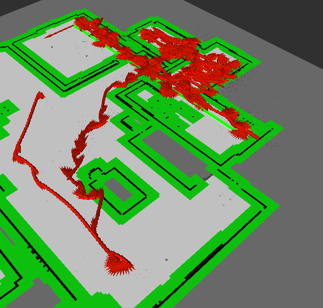

알고리즘


- 일단 이동
- 장애물을 회피하는건 어려울 것 같음(라이다로 각도 좁혀서 판단해도 제대로 하기가 어려움)
- 장애물에 부딪히면 회복하는 것으로 하자.
  - 장애물에 부딪히면 일단 이동 방향의 반대로 움직인다. (전진 => 후진, 후진 => 전진)
  - 그 다음 일정 각도 회전한다. (45도 정도로 하자.)
    - 이건 out_rad_vel을 유지한 채 for문으로 여러 번 publish 해줘야 할 것 같다.
    - 그게 아니면, flag를 하나 만들어서 flag = 10 같은 값을 충돌 시 부여하고 한 번 publish 할 때마다 -1 해준다.
  - 해당 각도에서 라이다 센서로 거리를 측정하여 정면에 장애물이 있는지 확인
    - 장애물이 있으면 한번 더 회전
    - 장애물이 없으면 그 방향으로 일정 거리 이상 움직이기 (0.5m ~ 1m 정도?)
    - 만약 이게 잘 안되면 cleaning1 처럼 다시 충돌할 때 까지 움직여보자.
  - 이제 새로운 경로가 만들어졌을 것이므로 원래대로 움직인다.


## 현황

1. 전-후방 충돌 판단 완료

   **path_tracking.py/lidar_callback 함수**

   ```python
   # 전/후방 충돌 감지
   self.collision = False
   forward_right = self.lidar_msg.ranges[0:5] # 정면의 라이다 값
   forward_left = self.lidar_msg.ranges[356:360]
   # 전방 충돌했다면 forward_right와 forward_left의 평균을 낸 값이 0.1 이하일 것이다.
   forward = (sum(forward_right) + sum(forward_left)) / 9
   if forward < 0.1:
       self.collision_forward = True
       print("전방 충돌")
       else:
           self.collision_forward = False
           backward = self.lidar_msg.ranges[176:185]
           backward = sum(backward) / 9
           if backward < 0.1:
               self.collision_backward = True
               print("후방 충돌")
               else:
                   self.collision_backward = False
   ```

   

2. 정지 상태 판단 완료

   **path_tracking.py/odom_callback 함수**

   ```python
       def odom_callback(self, msg):
           self.is_odom=True
           self.odom_msg=msg
           # 정지 상태 - 초기값 설정
           print(self.stop_cnt)
           if self.stop_cnt <= 0:
               self.turtle_pos_x = msg.pose.pose.position.x
               self.turtle_pos_y = msg.pose.pose.position.y
               self.stop_cnt = 1
           # stop_cnt가 300 이상이면 완전 정지 상태로 판단
           elif self.stop_cnt > 300:
               self.is_stop = True
           else:
               # stop_cnt가 1에서 300 이하인 경우 현재 멈춰있는지 판단해야 함
               # 탈출을 시도하기 전 상태, 충돌이 일어난 것이 아닐 때
               if not self.collision_forward and not self.collision_backward:
                   # 저장해놓은 위치와 현재 위치 사이의 거리를 계산
                   distance = sqrt((self.turtle_pos_x-msg.pose.pose.position.x) ** 2 + \
                                   (self.turtle_pos_y-msg.pose.pose.position.y) ** 2)
                   # 거리 차이가 매우 작으면 현재 정지 상태로 판단
                   if distance < 0.00001:
                       # print("정지 상태!")
                       self.stop_cnt += 1 # 정지 상태가 일정 시간 지나면 탈출 로직 작동
                   else:
                       self.turtle_pos_x = msg.pose.pose.position.x
                       self.turtle_pos_y = msg.pose.pose.position.y
                       self.is_stop = False
                       self.stop_cnt = 0 # 잠깐이라도 정지 상태가 풀리면 정지 상태 초기화
   ```


3. state별 동작 나누기

   - state1 - path tracking 상태
   - state2 - 정면 충돌 상태 해결 로직
     - 후진 => 충돌을 벗어남(라이다 센서 거리 > 0.5m) => 시계방향 회전(0.35 rad/s  약 1초간 진행) => 직진 약 1초간 진행
   - state3 - 후면 충돌 상태 해결 로직
     - 직진 => 충돌을 벗어남(라이다 센서 거리 > 0.5m) => 시계방향 회전(0.35 rad/s  약 1초간 진행) => 직진 약 1초간 진행
   - state6 - 직진 명령
   - state7 - 후진 명령
   - state8 - 회전 명령

   

4. state별 동작을 나눠 정면 충돌, 후면 충돌을 벗어날 수는 있지만 아직 몇 가지 문제점이 있었다.

   [1] 맵의 grid value가 127인 곳에 터틀봇이 위치하는 경우(색칠은 해놨지만 못 가는 위치는 아님)에는 a_star 알고리즘에서 시작점을 grid value = 0 인 곳으로 제한하고 있기 때문에 경로가 생성되지 않는다.

   [2] 충돌이 감지되지 않은 상태에서 멈춰있는 경우가 있다. (얇은 물건이나 사람 다리에 부딪혀 있는 경우 등)

   [3] 터틀봇이 끼여서 조작을 통해 벗어날 수 없는 경우가 있다.

   

5. [2] 문제를 해결하기 위해 stop_cnt 라는 변수를 도입하여, odom을 이용하여 현재 위치에 터틀봇이 머물러 있는 시간(횟수)을 카운트했고, 300에 도달하면 is_stop을 True로 만들고(처음에는 이걸로 상태 조작을 하려 했음) self.state = 2로 만들어 정면 충돌 상태 해결 로직을 실시하였다.

   ```python
       def odom_callback(self, msg):
           self.is_odom=True
           
   		...
           
               self.stop_cnt = 1
           # stop_cnt가 300 이상이면 완전 정지 상태로 판단
           elif self.stop_cnt > 300:
               self.is_stop = True
               self.state = 2
               self.stop_cnt = 0
   ```

   

   - 개선 가능 사항: 무조건 정면 충돌 로직이 아니라 lidar 앞 뒤를 확인하여 더 거리가 먼 곳으로 움직이도록 하면 좋을 것 같다.

6. [1] 문제를 해결하기 위해 현재 목적지(goal)가 있는데 경로는 없는 경우에 대한 로직을 추가하였다.

   ```python
               elif self.is_status \
       		and self.is_odom \
       		and self.is_goal \
           	and (self.goal != self.current_pos) \
           	and not self.path_exists:
                   print("통과!")
                   # 목적지가 있으면 goal_pose 통신이 이루어진다.
                   # 전방, 후방 lidar distance 확인 후 더 먼 쪽으로 이동한다.
                   if self.forward > self.backward:
                       self.out_vel = 0.5
                       self.out_rad_vel = 0.1
                   else:
                       self.out_vel = -0.5
                       self.out_rad_vel = 0.1
                   self.cmd_msg.linear.x = self.out_vel
                   self.cmd_msg.angular.z = self.out_rad_vel
                   self.cmd_pub.publish(self.cmd_msg)
   ```

   라이다를 이용하여 더 거리가 멀게 측정된(장애물이 있을 가능성이 낮은) 방향으로 이동하도록 하였다.

7. 여기까지만 해도 여전히 좁은 공간에서의 충돌시 갇혀버리는 문제 등이 발생해서 랜덤 라이브러리를 이용하여 낮은 확률로 전진 회전, 후진 회전하는 로직을 추가하였다.

   ```python
               if random.randint(0, 31) > 27:
                   self.out_vel = 0.5
                   self.out_rad_vel = 0.1
                   self.cmd_msg.linear.x = self.out_vel
                   self.cmd_msg.angular.z = self.out_rad_vel
                   self.cmd_pub.publish(self.cmd_msg)
               elif random.randint(0, 30) < 3:
                   self.out_vel = -0.5
                   self.out_rad_vel = -0.1
                   self.cmd_msg.linear.x = self.out_vel
                   self.cmd_msg.angular.z = self.out_rad_vel
                   self.cmd_pub.publish(self.cmd_msg)
   ```

   약 10% 확률로 전진 혹은 후진하게 된다.

   여기까지 완료한 후 청소를 실행해본 결과 아래 사진과 같이 이동한 후 끼임 문제가 발생하였다.



8. 이제 끼임 문제를 해결해야 한다.

