# README


## 0. 폴더구조

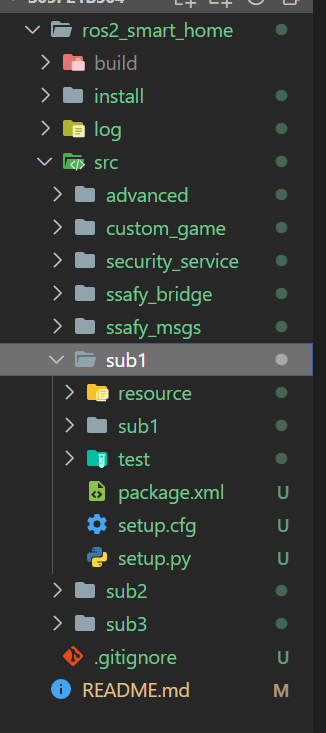

이렇게 구성하고 ros2_smart_home 폴더에서 colcon build 한다.


## 1. SUB1 목표

- 시뮬레이터에서 보내주는 상태, 환경, 센서 메시지를 받아서 확인
- 시뮬레이터로 제어 메시지들을 보내서 제어가 잘 되는지 확인
- Hadn Control Custom Object 제어 메시지를 보내서 Custom Object를 옮길 수 있는지 확인
- 주행기록계를 통해 경로 생성 및 경로 추종을 하는 것


## 프로젝트 실행 및 결과

### 1. ROS 메시지 통신 노드 실행

`call C:\dev\ros2_eloquent\setup.bat`

`call C:\Users\multicampus\Desktop\S05P21B304\ros2_smart_home\install\local_setup.bat`

`ros2 run sub1 publisher`

`ros2 run sub1 subscriber`

/test 로 잘 출력된다.


### 2. IoT(로봇, 가전, 환경)의 상태, 제어 메시지 송수신

#### print(cmd_msg)

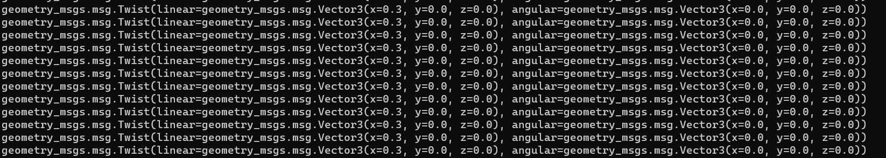


#### turtlebot_status

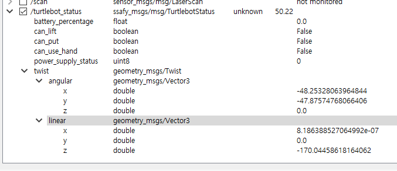

#### 가전제품 data

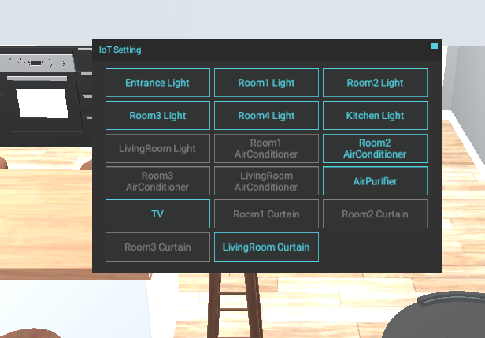

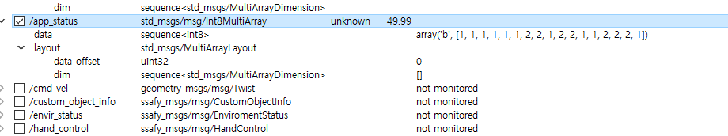

IoT Setting에 표시되어 있는 순서대로 /app_status의 data에 받아오게 된다.

켜지면 1, 꺼지면 2

예를 들어 Entrance Light는 맨 처음에 있기 때문에 array의 0번 인덱스에 1로 들어가있고,

Room3 Curtain은 꺼져있기 때문에 array의 15번 인덱스에 2로 들어가있다.


### 3. 카메라 데이터 수신 및 영상처리

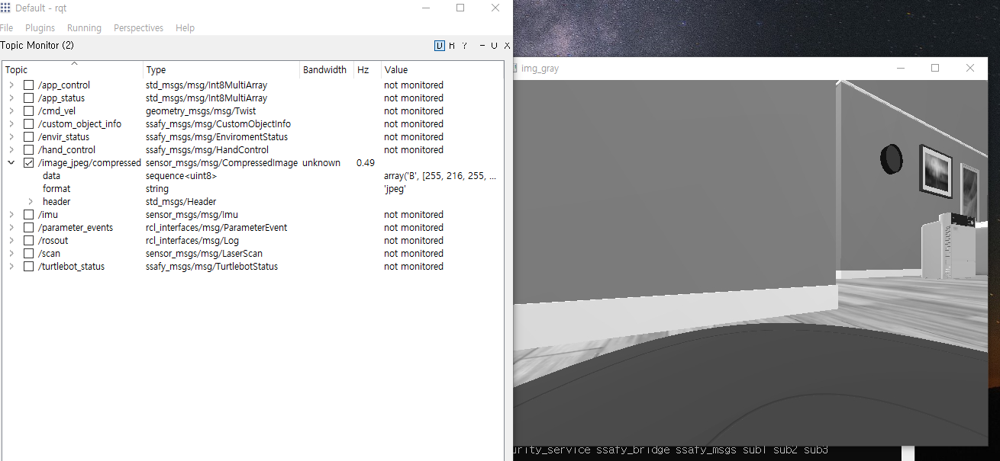

카메라 장착은 settings - setting edit mode에 들어가서 카메라를 선택한 후 원하는 위치에 shift + 좌클릭으로 할 수 있었다.

+버튼을 눌러도 어디 추가되거나 하는건 없었다. 차라리 +버튼은 없애는게 좀 더 직관적일 것 같다.


카메라를 장착했으면 포트번호를 입력해야 한다. host의 포트 번호는 1231, destination 포트 번호는 1232로 설정하면 정상 작동해야 한다.

`ros2 launch ssafybridge_launch.py`를 할 때 이미지 데이터를 publish 하게 되는데, 이게 잘 될 때가 있고 안 될 때가 있는 것 같다. 매우 짧은 간격으로 데이터를 계속해서 전달하려다 보니 렉이 걸리는건지, imshow로 출력한 이미지는 응답 없음이 자주 뜨고, 이유 모르게 연결이 끊기기도 한다. 위 사진은 연결이 잘 되었을 때 찍은 gray scale 변환 이미지이다. Hz가 0.49로 매우 낮았다.


### 4. Hand Control

일단 control mode의 value가 바뀔 때마다 publish를 매번 해줘야 했는데 해주지 않고 있었다.

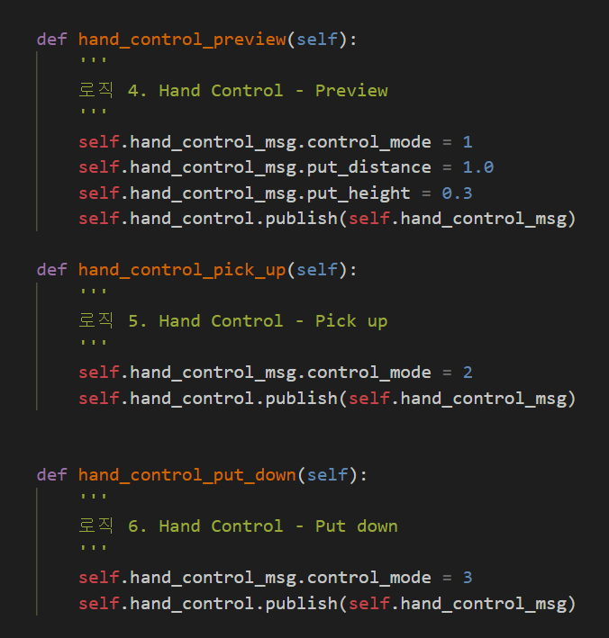

이렇게 매번 publish를 해주는게 맞는 것 같다.


이렇게만 해도 한 번 value를 입력하면 제대로 동작하지 않는다. 그런데 아래처럼 세 번 정도 연타하면 Hz가 뜨면서 연결이 된다.. 

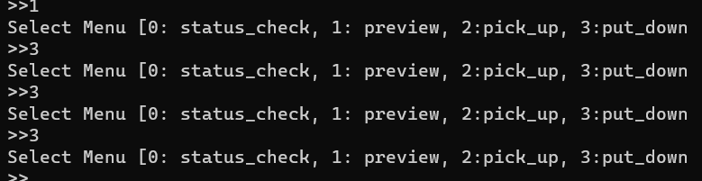

이건 실제 사용되는 코드를 작성할 때 custom_game / game.py에 있는 것처럼 hand_control을 계속해서 실행시키는 방법으로 해결할 수 있을 것 같다. 일단 넘어가도 되겠다.

**game.py**

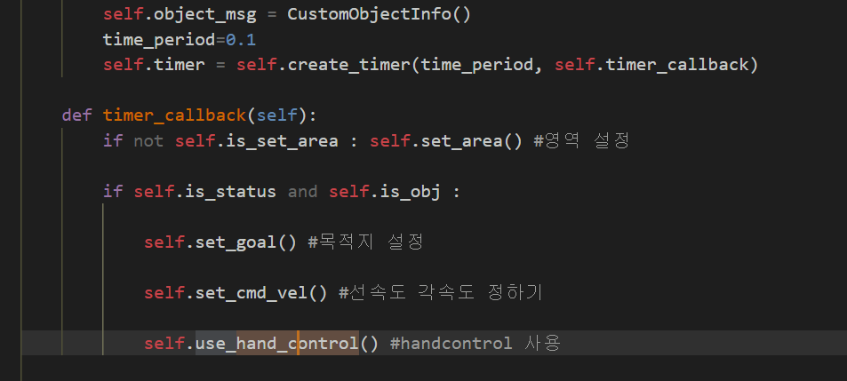

`def.__init__` 에 있는 timer에서 timer_callback을 time_period마다 실행하고, timer_callback은 use_hand_control을 매번 실행해서 연결이 유지되도록 하고 있다.


### 5. Odometry를 이용한 상대경로 생성 및 경로 추종

#### odom.py

Odometry 코드 작성은 쉬웠다.

```python
    def imu_callback(self,msg):
        # 로직 3. IMU 에서 받은 quaternion을 euler angle로 변환해서 사용
        # 이게 방법1, 관성센서에서 측정한 orientation을 이용하려면 이렇게 하면 됨
        if self.is_imu ==False :    
            self.is_imu=True
            imu_q = Quaternion(msg.orientation.w, msg.orientation.x, msg.orientation.y, msg.orientation.z)
            imu_e = imu_q.to_euler(degrees = False)
            self.imu_offset= imu_e[2]

        else :
            imu_q = Quaternion(msg.orientation.w, msg.orientation.x, msg.orientation.y, msg.orientation.z)
            imu_e = imu_q.to_euler(degrees = False)
            self.theta = imu_e[2] - self.imu_offset
            # print("imu_e: {} theta: {}".format(imu_e, self.theta))

    # orientation을 계산해서 사용하려면 이렇게 하면 됨
    def listener_callback(self, msg):
        # print('linear_vel : {}  angular_vel : {}'.format(msg.twist.linear.x,-msg.twist.angular.z))
        if self.is_imu ==True:
            if self.is_status == False:
                self.is_status=True
                self.prev_time=rclpy.clock.Clock().now()
            else:
                self.current_time=rclpy.clock.Clock().now()
                # 계산 주기를 저장한 변수 입니다. 단위는 초(s)
                self.period=(self.current_time-self.prev_time).nanoseconds/1000000000
                # 로봇의 선속도, 각속도를 저장하는 변수, 시뮬레이터에서 주는 각 속도는 방향이 반대이므로 (-)를 붙여줍니다.
                linear_x=msg.twist.linear.x
                angular_z=-msg.twist.angular.z
                '''
                로직 4. 로봇 위치 추정
                (테스트) linear_x = 1, self.theta = 1.5707(rad), self.period = 1 일 때
                self.x=0, self.y=1 이 나와야 합니다. 로봇의 헤딩이 90도 돌아가 있는
                상태에서 선속도를 가진다는 것은 x축방향이 아니라 y축방향으로 이동한다는 뜻입니다.
                '''

                self.x += linear_x * cos(self.theta) * self.period
                self.y += linear_x * sin(self.theta) * self.period
                self.theta += angular_z * self.period

                self.base_link_transform.header.stamp =rclpy.clock.Clock().now().to_msg()
                self.laser_transform.header.stamp =rclpy.clock.Clock().now().to_msg()
                
                # 로직 5. 추정한 로봇 위치를 메시지에 담아 publish, broadcast

                q = Quaternion.from_euler(0, 0, self.theta)
                
                self.base_link_transform.transform.translation.x = self.x
                self.base_link_transform.transform.translation.y = self.y
                self.base_link_transform.transform.rotation.x = q.x
                self.base_link_transform.transform.rotation.y = q.y
                self.base_link_transform.transform.rotation.z = q.z
                self.base_link_transform.transform.rotation.w = q.w
                
                self.odom_msg.pose.pose.position.x = self.x
                self.odom_msg.pose.pose.position.y = self.y
                self.odom_msg.pose.pose.orientation.x = q.x
                self.odom_msg.pose.pose.orientation.y = q.y
                self.odom_msg.pose.pose.orientation.z = q.z
                self.odom_msg.pose.pose.orientation.w = q.w
                self.odom_msg.twist.twist.linear.x = linear_x
                self.odom_msg.twist.twist.angular.z = angular_z

                self.broadcaster.sendTransform(self.base_link_transform)
                self.broadcaster.sendTransform(self.laser_transform)
                self.odom_publisher.publish(self.odom_msg)
                self.prev_time=self.current_time
```

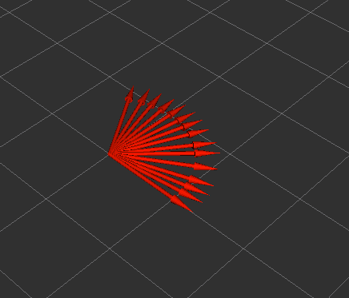

실행하고 회전을 좀 해보면 위와 같이 잘 그려진다.

imu로 theta를 계산할 수도 있고(imu_callback 이용), 적분으로 계산할 수도 있다. (listener_callback)

처음에 둘 중 적분을 이용해서 그려보려고 코드 32번 줄에 있는

`self.imu_sub = self.create_subscription(Imu,'/imu',self.imu_callback,10)`를 주석처리 했다가 

```python
def imu_callback(self,msg):
        # 로직 3. IMU 에서 받은 quaternion을 euler angle로 변환해서 사용
        # 이게 방법1, 관성센서에서 측정한 orientation을 이용하려면 이렇게 하면 됨
        if self.is_imu ==False :    
            self.is_imu=True
            imu_q = Quaternion(msg.orientation.w, msg.orientation.x, msg.orientation.y, msg.orientation.z)
            imu_e = imu_q.to_euler(degrees = False)
            self.imu_offset= 0.0
```

이 부분이 실행되지 않아서 self.is_imu가 False로 남았고

```python
 # orientation을 계산해서 사용하려면 이렇게 하면 됨
    def listener_callback(self, msg):
        # print('linear_vel : {}  angular_vel : {}'.format(msg.twist.linear.x,-msg.twist.angular.z))
        if self.is_imu ==True:
            if self.is_status == False:
```

그 결과 listener_callback의 if문이 실행되지 않는 문제가 발생했다.

스켈레톤 코드를 작성한 분이 imu 데이터를 받은 후에 listener_callback이 실행되는 것을 의도해서 이렇게 코드를 짠 것 같다. 그러려니 하고 넘어감


#### make_path.py

사전 학습에서 다룬 내용이었다.

딱 한 가지 다른 점은 경로 설정이었다. 

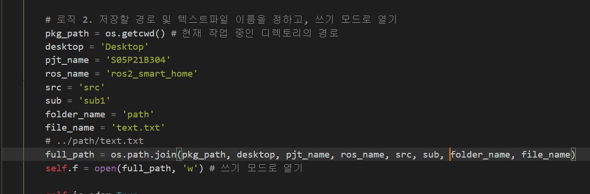

어찌된 일인지 pkg_path = os.getcwd()가 예상과는 다르게 C:\users\multicampus 까지만 표현을 했다.

그래서 나머지 주소도 이어붙여줬고, odom을 실행하고 make_path를 실행한 결과 make_path 종료 후 text.txt 파일에 지나온 경로가 잘 저장되었다.

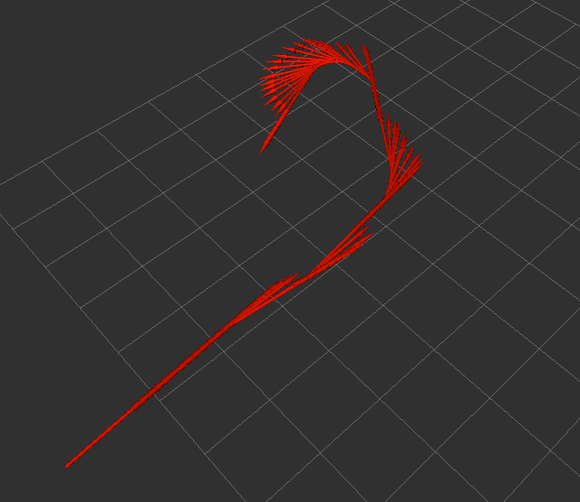

이제 경로 추종으로 이런 경로를 따라 움직이는지 확인해보면 된다.


#### path_pub.py

make_path에서 만들어놓은 경로를 읽어서 Path 메시지에 넣어준 후 publish 하는 과정이었다.

사전학습과 동일하여 크게 어려운 부분은 없었고, 코드를 약간 줄인 부분이 있어 적어놓으려 한다.

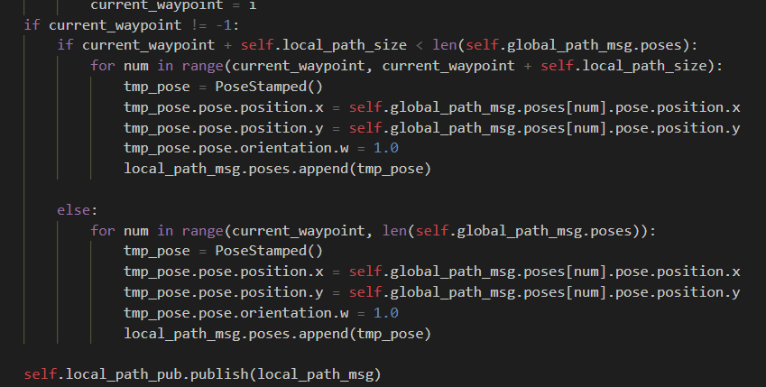

줄이기 전 코드이고, 같은 코드가 두 번 반복된다.


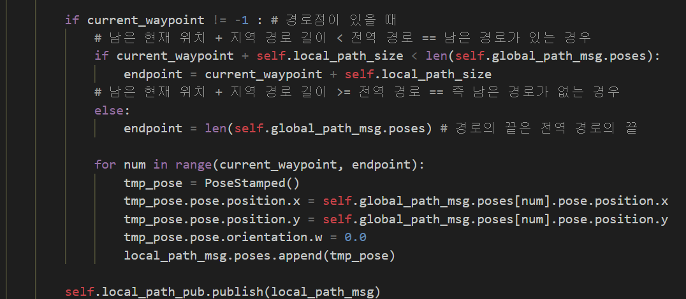

주석 때문에 별로 안 줄어든 것으로 보이지만 같은 코드를 한 번만 사용했다.


#### path_tracking.py

이 코드도 마찬가지로 사전학습때 배운 것으로 완성할 수 있었다.

다만 앞으로 고려해야 할 점이 있어 기록한다.

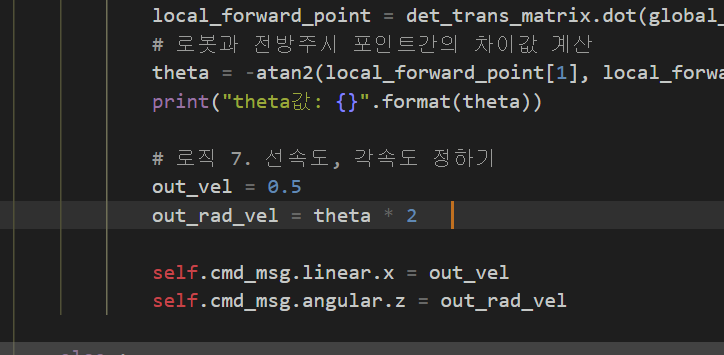

이 부분에서 선속도와 각속도를 잘 정해줘야 path를 제대로 따라갈 수 있다. out_rad_vel이 너무 커서 직선 경로는 잘 따라갔지만 회전이 시작되는 순간 경로를 제대로 따라가지 못하는 문제가 있었다. 아예 엄청 작게 만들던가, path를 기록할 당시의 속도와 비슷하게 하는 등의 조치가 필요하다.

theta가 크면 빠르게, 작으면 느리게 하는 것도 괜찮아 보인다.


## sub1 후기

- 이제 코드가 어떻게 동작하는지 조금은 알 것 같다.
- 자율주행 부분을 맡게 되었는데 지금 이렇게 간단한 코드를 이용해서 어떻게 복잡한 경로를 이동하게 할 수 있을지 많은 고민이 필요할 것 같다.
- 마지막 gif 파일을 보면 알 수 있듯 선속도, 각속도에 따라 경로를 완벽하게 추종할지 그렇지 못할지가 결정된다. 적절한 값 혹은 식을 찾아서 넣어줘야겠다.


## 추가1

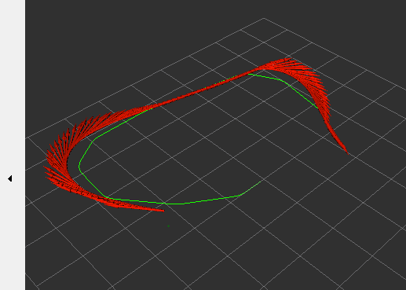

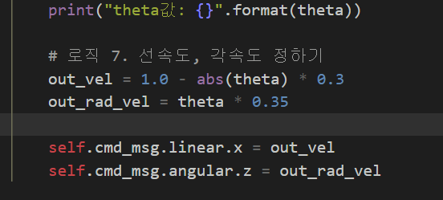

현재 위와 같이 선속도와 각속도를 입력하였더니 얼추 비슷한 경로로 이동..

그런데 설명에는 out_rad_vel이 theta를 0.05(갱신 주기)로 나눈 값이라고 하는데 이게 맞는건지 모르겠다.


## 추가2

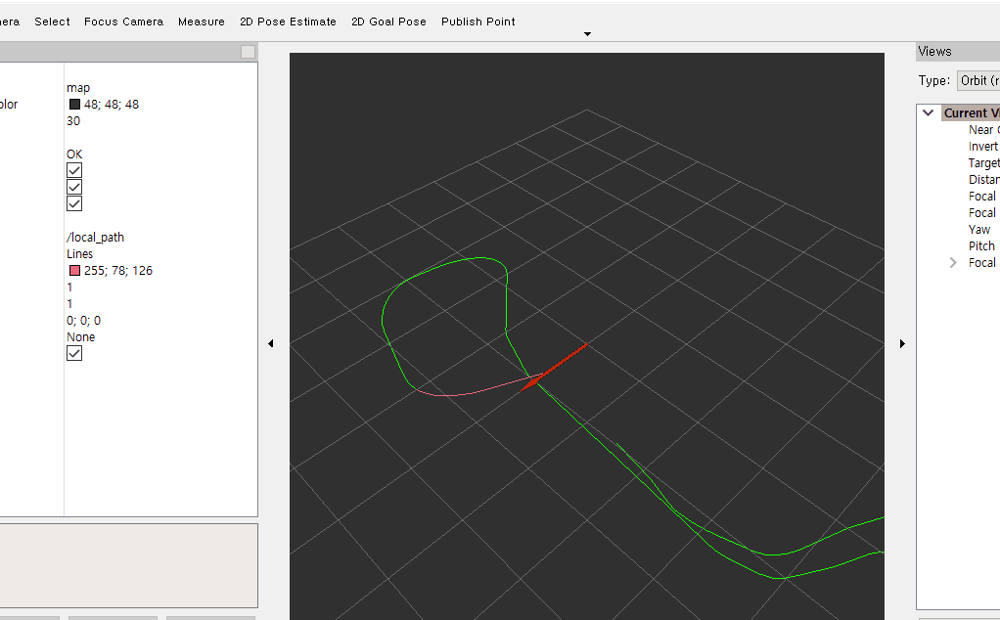

경로가 겹치는 경우 순서대로 제대로 따라가지 못하고 같은 경로를 반복하는 문제가 있었다.

path_pub.py에서 publish의 시작점을 매번 결정하는데, 이때 그 시작점이 갑자기 동떨어지지 않도록 범위를 지정해주는 방법으로 해결할 수 있었다.

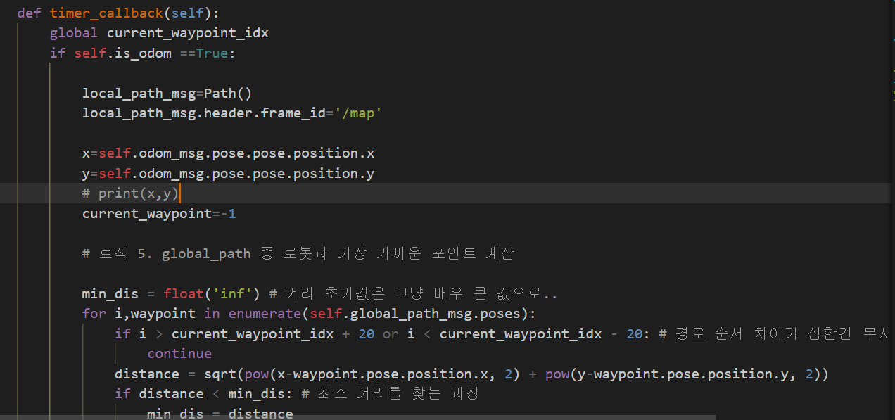

`if i > current_waypoint_idx + 20 or i < current_waypoint_idx - 20` 부분이다.

current_waypoint_idx는 매번 바뀌는 전역경로의 시작점 current_waypoint를 전역변수로 따로 저장해놓은 것으로, 갱신될 때 그 차이가 인덱스 20개 범위 내에서 이루어지도록 제한한 것이다.


그래도 좀 불완전하다는 생각이 든다. 더 좋은 방법이 있지 않을까?
