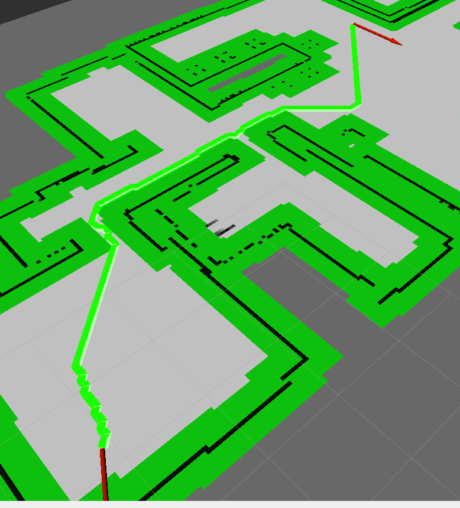

# Dijkstra와 a_star의 차이

참고 https://msc9533.github.io/2020/05/a-star/

## 1. Dijkstra 알고리즘

다익스트라 구현 코드는 다음과 같다.

```python
def dijkstra(self,start):


    Q = []
    heapq.heappush(Q,(0,start))
    self.cost[start[0]][start[1]] = 1
    found = False
    '''
        로직 7. grid 기반 최단경로 탐색
        '''
    # heap을 쓰는게 더 빠른듯 하여 heap 사용
    while Q:
        cost,current = heapq.heappop(Q) # Q.leftpop()
        if self.goal[0] == current[0] and self.goal[1] == current[1]:
            found = True
            break

            for i in range(8):
                next = (current[0] + self.dx[i], current[1] + self.dy[i])
                if next[0] >= 0 and next[1] >= 0 and next[0] < self.GRIDSIZE and next[1] < self.GRIDSIZE:
                    if self.grid[next[0]][next[1]] < 50:
                        if self.cost[current[0]][current[1]] + self.dCost[i] < self.cost[next[0]][next[1]]:
                            self.cost[next[0]][next[1]] = self.cost[current[0]][current[1]] + self.dCost[i]
                            self.path[next[0]][next[1]] = current
                            heapq.heappush(Q,(self.cost[next[0]][next[1]],next))
                            node = self.goal
                            while node != start:
                                if type(node) == type(1):
                                    return
                                nextNode = self.path[node[0]][node[1]]
                                self.final_path.append(node)
                                node = nextNode
```

핵심 부분은 아래 부분이다.

```python
if self.cost[current[0]][current[1]] + self.dCost[i] < self.cost[next[0]][next[1]]:
	self.cost[next[0]][next[1]] = self.cost[current[0]][current[1]] + self.dCost[i]
	self.path[next[0]][next[1]] = current
	heapq.heappush(Q,(self.cost[next[0]][next[1]],next))
```

현재 위치인 `self.cost[current[0][current[1]]]`에서 다음 위치로 가는 비용 `self.dCost[i]`를 더한 값이

`self.cost[next[0]][next[1]]` 보다 작으면 그 값으로 다음 노드의 cost를 바꿔주는 방식이다. 이렇게만 하고 global_path 기본경로인 에어컨 앞까지 가는 경로를 그려보면 다음 그림과 같다.


## 2. A* 알고리즘

A* 알고리즘은 다익스트라와 구조가 동일한데, 여기에 휴리스틱 함수라고 해서 현재 위치에서 목적지까지의 거리를 추정한 값을 추가하여 cost를 계산한다는 점이 다르다. 휴리스틱 함수는 여러 가지 방법으로 구할 수 있으며, 예를 들어 맨하탄 거리를 구하거나, 피타고라스의 정리로 대각선 거리를 구할 수 있다.

우선은 대각선 거리를 구하는 A* 알고리즘을 구현해보자.

```python
def heuristics(node):
    return math.sqrt((node[0] - self.goal[0])**2+(node[1] - self.goal[1])**2)
def dijkstra(self,start):
    Q = []
    heapq.heappush(Q,(0,start))
    self.cost[start[0]][start[1]] = 1
    found = False
    '''
        로직 7. grid 기반 최단경로 탐색
        '''
    # heap을 쓰는게 더 빠른듯 하여 heap 사용
    while Q:
        cost,current = heapq.heappop(Q) # Q.leftpop()
        if self.goal[0] == current[0] and self.goal[1] == current[1]:
            found = True
            break

            for i in range(8):
                next = (current[0] + self.dx[i], current[1] + self.dy[i])
                if next[0] >= 0 and next[1] >= 0 and next[0] < self.GRIDSIZE and next[1] < self.GRIDSIZE:
                    if self.grid[next[0]][next[1]] < 50: # 50보다 작은 값인 경우 이동 가능한 것으로 본다.
                        deltaCost = self.dCost[i] + heuristics(next)
                        if  self.cost[next[0]][next[1]] > self.cost[current[0]][current[1]] + deltaCost:
                            self.cost[next[0]][next[1]] = self.cost[current[0]][current[1]] + deltaCost
                            self.path[next[0]][next[1]] = current
                            heapq.heappush(Q, (self.cost[next[0]][next[1]], next)) # Q.append(next)

                            node = self.goal
                            while node != start:
                                if type(node) == type(1):
                                    return
                                nextNode = self.path[node[0]][node[1]]
                                self.final_path.append(node)
                                node = nextNode
```

다익스트라와 비교해서 달라진 점은, heuristics 함수가 추가되었다는 점, 그리고 이를 이용하여 deltaCost를 계산하고, 

`self.cost[next[0]][next[1]] = self.cost[current[0]][current[1]] + self.dCost[i]` 처럼 dCost를 더하는 대신

`self.cost[next[0]][next[1]] = self.cost[current[0]][current[1]] + deltaCost` 처럼 deltaCost를 더한다는 점이다.

이를 이용하여 기본 경로를 그려보면 다음과 같다.


길이 꼬불꼬불하다.. 이건 못 쓸 것 같다. 맨하탄 거리를 사용하면 어떨까?

```python
    def heuristics(node):
        # return math.sqrt((node[0] - self.goal[0])**2+(node[1] - self.goal[1])**2) # 피타고라스
        return abs(node[0] - self.goal[0]) + abs(node[1] - self.goal[1]) # 맨하탄
```

위와 같이 함수를 변경하고 실행한 결과는 다음과 같다.


이게 제일 말이 되고 깔끔한 것 같다. 다익스트라까지 해서 다른 경로도 확인해보자.


#### 1) 다익스트라


#### 2) A* 맨하탄


#### 3) A* 피타고라스




역시 피타고라스는 못 쓸 것 같다...


