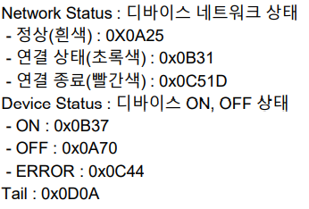

# iot_udp.py 설명

[toc]

## 로직3. 수신 데이터 파싱

```python
    def data_parsing(self,raw_data) :
        print("수신 데이터: ", raw_data) # 수신한 데이터 확인
        
        '''
        로직 3. 수신 데이터 파싱

        header=?
        data_length=?
        aux_data=?


        if header == ?? and data_length[0] == ??:
            uid_pack=??
            uid=self.packet_to_uid(uid_pack)
        
            network_status=??
            device_status=??
            
            self.is_recv_data=True
            self.recv_data=[uid,network_status,device_status]
        '''
```

수신 데이터는 다음과 같이 생겼다. (맵3에서 에어컨같은거 세워놓고 근처로 가면 데이터 수신)

b'#Appliances-Status$\x14\x00\x00\x00\x00\x00\x00\x00\x00\x00\x00\x00\x00\x00\x00\x00\x03\x8a\xedU\x9c@G\xaa\x87\xaetZHu\xfbt\n%\np\r\n'

또한 IOT 상태 프로토콜(User <= Sim)은 다음과 같다.


Header: #Appliances-Status$ 가 19글자로 19byte (영어와 특수문자는 하나에 1byte)

DATA Length: \x14\x00\x00\x00 가 4바이트 (20, 0, 0, 0)이 들어있는 바이트 배열을 나타냄

AUX_DATA: \x00\x00\x00\x00\x00\x00\x00\x00\x00\x00\x00\x00 가 12바이트

...

이런 식이다.

출력해보면,

```python
    def data_parsing(self,raw_data) :
        # print("수신 데이터: ", raw_data) # 수신한 데이터 확인
        
        # 로직 3. 수신 데이터 파싱

        header=raw_data[:19].decode('utf-8')
        data_length=raw_data[19:23]
        aux_data=raw_data[23:35]

        print("헤더: ", header)
        print("데이터 길이: ", data_length[0])
        print("aux_data: ", aux_data)
        
-------------------------------------------------------------
헤더:  #Appliances-Status$
데이터 길이:  20
aux_data:  b'\x00\x00\x00\x00\x00\x00\x00\x00\x00\x00\x00\x00'
```

출력 규칙은 다음과 같다고 한다. (https://it-eldorado.tistory.com/80)

1. 출력 가능한 형태의 1바이트 ASCII 문자들은 그대로 출력한다.
2. 그렇지 않은 나머지 경우에는 바이트의 값을 16진수의 형태(\x??)로 출력한다.


나머지도 해보면,

```python
        if header == "#Appliances-Status$" and data_length[0] == 20:
            uid_pack=raw_data[35:51] # AUX_DATA 이후의 16바이트
            uid=self.packet_to_uid(uid_pack)
            print("uid: ", uid)
            network_status=raw_data[51:53]
            device_status=raw_data[53:55]
            print("network_status: ", network_status)
            print("device_status: ", device_status)
            self.is_recv_data=True
            self.recv_data=[uid,network_status,device_status]
            
-------------------------------------------------------------
uid:  038aed559c4047aa87ae745a4875fb74
network_status:  b'\n%'
device_status:  b'\np'
```



위 사진을 보면 Network Status, Device Status별 상태가 나온다.

**Network Status**

0X0A25는 0A\25 = 10과 16*2+5 = 10과 37이다.

0X0B31은 0B\31 = 11과 16*3+1 = 11과 49이다.

0X0C51는 0C\51 = 12와 81이다.  <= 51D는 오타인듯?

따라서

- 정상: 10 37
- 연결 상태(초록색): 11 49
- 연결 종료(빨간색): 12 81

**Device Status**

0x0B37은 0B\37 = 11과 55

0x0A70은 0A\70 = 10과 112

0x0C44는 0C\44 = 12와 68

따라서

- ON: 11 55
- OFF: 10 112
- ERROR: 12 68

다음과 같이 수정하고 출력을 확인해보면 현재 네트워크와 디바이스의 상태를 명확히 알 수 있다.

```python
        if header == "#Appliances-Status$" and data_length[0] == 20:
            uid_pack=raw_data[35:51] # AUX_DATA 이후의 16바이트
            uid=self.packet_to_uid(uid_pack)
            print("uid: ", uid)
            network_status=raw_data[51:53]
            device_status=raw_data[53:55]
            print("network_status: ", network_status[0], network_status[1])
            print("device_status: ", device_status[0], device_status[1])
            self.is_recv_data=True
            self.recv_data=[uid,network_status,device_status]
--------------------------------------
uid:  038aed559c4047aa87ae745a4875fb74
network_status:  10 37
device_status:  10 112
```

네트워크 상태는 정상, 장치 상태는 OFF임을 알 수 있다.


출력을 보기 좋게 하기 위해 다음과 같이 수정

```python
        if header == "#Appliances-Status$" and data_length[0] == 20:
            uid_pack=raw_data[35:51] # AUX_DATA 이후의 16바이트
            uid=self.packet_to_uid(uid_pack)
            print("uid: ", uid)
            network_status=raw_data[51:53]
            device_status=raw_data[53:55]
            if network_status[0] == 10 and network_status[1] == 37:
                print("네트워크 연결: 정상")
            if network_status[0] == 11 and network_status[1] == 49:
                print("네트워크 연결: 연결중")
            if network_status[0] == 12 and network_status[1] == 81:
                print("네트워크 연결: 연결 종료")
            if device_status[0] == 11 and device_status[1] == 55:
                print("디바이스 ON")
            if device_status[0] == 10 and device_status[1] == 112:
                print("디바이스 OFF")
            if device_status[0] == 12 and device_status[1] == 68:
                print("디바이스 ERROR")
```


## 로직4. 데이터 송신 함수 생성


위 그림을 보고 작성

```python
    def send_data(self,uid,cmd):
        
        pass
        # 로직 4. 데이터 송신 함수 생성

 
        header=b"$Ctrl-command$"
        data_length=bytes([0x12, 0x0, 0x0, 0x0])
        aux_data=bytes([0x0] * 12)
        self.upper=header + data_length + aux_data
        self.tail=bytes([0x0D, 0x0A])

        uid_pack=self.uid_to_packet(uid)
        cmd_pack=bytes([cmd[0],cmd[1]])

        send_data=self.upper+uid_pack+cmd_pack+self.tail
        self.sock.sendto(send_data,(self.ip,self.send_port))
```


## 로직5. 사용자 메뉴 생성

```python
while True:
    로직 5. 사용자 메뉴 생성
    print('Select Menu [0: scan, 1: connect, 2:control, 3:disconnect, 4:all_procedures ] ')
    menu = int(input())

    if menu == 0:
        self.scan()
    elif menu == 1:
        self.connect()
    elif menu == 2:
        self.control()
    elif menu == 3:
    	self.disconnect()
    elif menu == 4:
        self.all_procedures()
```

그냥 입력받은 숫자에 따라 메서드를 실행시키는 코드


